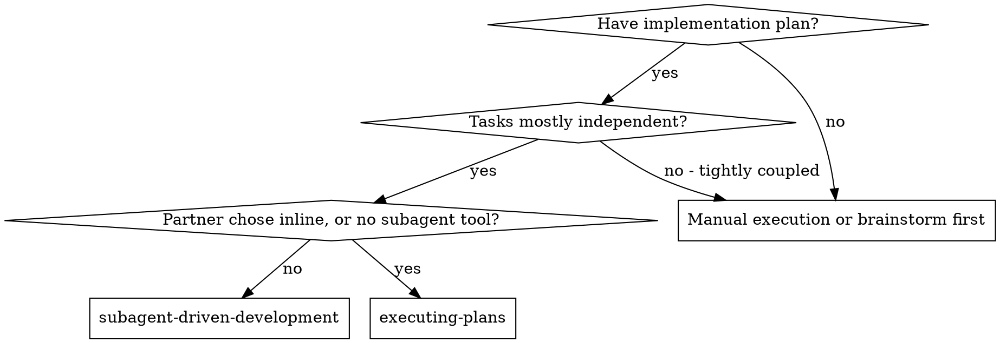

Follow the [invocation policy](../using-superpowers/references/invocation-policy.md).
Apply this workflow only when requested or accepted, including its stated supporting steps.

# Subagent-Driven Development

Execute plan by dispatching a fresh implementer subagent per task, a task review (spec compliance + code quality) after each, and a broad whole-branch review at the end.

**Why subagents:** You delegate tasks to specialized agents with isolated context. By precisely crafting their instructions and context, you ensure they stay focused and succeed at their task. They should never inherit your session's context or history — you construct exactly what they need. This also preserves your own context for coordination work.

**Core principle:** Fresh subagent per task + task review (spec + quality) + broad final review = high quality, fast iteration

Follow the shared [decision checkpoints](../using-superpowers/references/decision-checkpoints.md).

**Narration:** Follow host and human preferences; give concise updates about
findings, decisions, and remaining work.

**Continuous execution:** Continue through authorized tasks without routine
"should I continue?" prompts. Preserve approvals, delegated discretion, and
explicitly retained checkpoints.

**Decisions within scope.** Resolve routine details from the accepted spec,
current human instructions, and repository evidence. Record consequential
decisions as `Ruling: <decision> — <authority and reason> — <cost if wrong>`.
A ledger entry records authority; it does not create it.

A material change to requirements, acceptance criteria, cost, risk, or approach
outside delegated discretion needs the human's decision before affected work.
Workers surface the choice to you; answer from existing authority or ask the
human. Continue independent authorized tasks while awaiting the answer.
Follow host permissions for other actions, using authorization already supplied.

## When to Use



**vs. Executing Plans (inline):**
- Fresh subagent per task (no context pollution) instead of one context doing every task
- Review after each task (spec compliance + code quality) instead of only at the end
- Costs a fresh context per task and per review; inline costs one context plus one final reviewer
- Both run in this session, share the same plan workspace and ledger, and continue authorized tasks without routine approval prompts

## The Process

1. Read the accepted plan and decision record; establish the working context.
2. Dispatch a bounded task with its brief, authority, dependencies, and evidence.
3. Answer routine questions from evidence; route material choices through the
   human checkpoint before affected implementation.
4. Review the task against requirements and quality. Correct substantiated
   findings; reassess after repeated failed rounds without waiving requirements.
5. Record only completed work, then review the complete change and deliver
   the authorized result. Integrate or clean up only within requested scope.

## Setup

Preserve the named checkout and branch. Use superpowers:using-git-worktrees
when isolation is requested or included in the accepted workflow. Follow
repository restrictions and existing authorization before changing Git state.

Conversation memory does not survive compaction. In real sessions,
controllers that lost their place have re-dispatched entire completed task
sequences — the single most expensive failure observed. Track progress in
a ledger file, not only in todos.

- Each plan owns a workspace: at skill start, run this skill's
  `bash scripts/sdd-workspace PLAN_FILE` — it prints the plan's git-ignored
  directory (under `<repo-root>/.superpowers/sdd/`), home to
  every artifact for THIS plan: ledger, briefs, reports, review packages.
  Another plan's directory is never yours to read or write.
- Check this plan's ledger at `<workspace>/progress.md`. Match its plan
  identity and reconcile completion entries with the current repository and
  evidence. For committed work, inspect the named commits; for uncommitted work,
  inspect the recorded files/snapshot and current diff. Resume pending work
  without repeating settled questions. A completion line alone does not prove
  uncommitted files still exist. Leave other plans' ledgers untouched.
- Create the ledger with its identity as the first line:
  `# SDD ledger — plan: <plan file path>`.
- Preserve the decision record and evidence needed to identify the actual
  reviewed state across compaction.
- The workspace is ignored scratch. Cleanup can destroy its evidence, and
  Git history cannot recover uncommitted work. Do not rely on it as a backup.

Read the plan, Decision Record, Global Constraints, and referenced spec.
Confirm implementation is authorized; a plan-only request stops with the plan.
Carry approved and delegated decisions, their sources, pending choices, and
retained checkpoints into the ledger and each relevant task brief. Current
human corrections take precedence over older artifacts. Check the record on
resume; do not repeat settled questions. Resolve material gaps in a missing
spec before affected work. Create a todo per task.

Before dispatching Task 1, scan the plan once for conflicts, writing down
what you checked as you check it:

- tasks that contradict each other or the plan's Global Constraints
- anything the plan explicitly mandates that the review rubric treats as a
  defect (a test that asserts nothing, verbatim duplication of a logic block)

The scan's output is a table, not a verdict. One row for every pair of tasks
that share a file or an interface: the two tasks, what one produces against
what the other consumes, and what you found. One row for every task: whether
its own text agrees with itself — the tests it specifies against the code it
specifies, the files it creates against the files it later touches. "The scan
is clean" without those rows is not a scan you ran.

Write the table to the ledger. Resolve routine conflicts within existing
authority and record the evidence. Apply the decision checkpoints to material
choices before dispatching affected work; independent authorized tasks can
proceed. If the scan is clean, proceed. Apply the same rule to conflicts
that emerge during implementation.

## Model Selection

Use models and effort levels supported by the current host. Respect its context
fork rules and the human's selected configuration. Inherit the session default
when appropriate; specify an override only when allowed and useful for the task.

Match capability to uncertainty, integration complexity, and consequences.
A bounded mechanical edit may suit a smaller model; a subtle concurrency change
or broad architectural review needs stronger judgment. File count or a plan
containing code does not establish reasoning difficulty.

If a worker stalls, identify whether the cause is missing evidence, an unresolved
human decision, task size, or reasoning capability. Improve the brief or split
the work before repeating it; choose a stronger available model when capability
is the issue. A model upgrade cannot supply missing authority. Record measured
effort when comparing approaches; do not promise universal cost or speed gains.

## The Task Loop

**Batch small same-shape work.** When the plan lists several tasks that are
each a small, independent edit of the same kind — the same one-line fix,
constant change, or field addition repeated across files — do not dispatch
one subagent per task. Compose ONE dispatch brief listing every file and
its change, send the whole batch to a single subagent, and review its diff
as one unit. Reserve one-dispatch-per-task for work that needs its own
judgment, its own tests, or its own review surface.

Everything you paste into a dispatch prompt — and everything a subagent
prints back — stays resident in your context for the rest of the session
and is re-read on every later turn. Hand artifacts over as files.

**Waiting on dispatched subagents:** Keep doing independent local work while
workers run. When idle, use event-driven waits with timeouts compatible with
the host's responsiveness and progress-update rules. Reconcile completed or
failed workers when notified; avoid repeated unchanged status polling.

### 1. Dispatch the implementer

Record BASE (`git rev-parse HEAD`) before dispatching — the review package
and fix-round diffs need it. Also record relevant existing working changes;
BASE alone cannot identify uncommitted task boundaries. Use
[review evidence](review-evidence.md) for package contents and snapshot rules.

- **Task brief:** before dispatching an implementer, run this skill's
  `bash scripts/task-brief PLAN_FILE N` — it extracts the task's full text to a
  uniquely named file and prints the path. Compose the dispatch so the
  brief stays the single source of
  requirements. Your dispatch should contain: (1) one line on where this
  task fits in the project; (2) the brief path, introduced as "read this
  first — it is your requirements, with the exact values to use verbatim";
  (3) interfaces and decisions from earlier tasks that the brief cannot
  know; (4) the Decision Record, routine rulings, and unresolved material choices;
  (5) Global Constraints not included in the task text; (6) the report-file
  path and report contract. The helper extracts only task text. After each
  extraction, append or refresh the current task-relevant Decision Record,
  Global Constraints, and rulings in the generated brief before dispatch.
  Send that same updated brief to implementers, reviewers, and fresh fix workers. Exact values (numbers,
  magic strings, signatures, test cases) appear only in the brief. Never
  make a subagent read the whole plan file.
- **Report file:** name the implementer's report file after the brief
  (brief `…/task-N-brief.md` → report `…/task-N-report.md`) and put it in
  the dispatch prompt. The implementer writes the full report there and
  returns only status, commits, a one-line verification summary, and concerns.
- A dispatch prompt describes one task, not the session's history. Do not
  paste accumulated prior-task summaries ("state after Tasks 1-3") into
  later dispatches — a real session's dispatch hit 42k chars of which 99%
  was pasted history. A fresh subagent needs its task, the interfaces it
  touches, and the global constraints. Nothing else.
- The dispatch carries the no-subagents contract (it is in the
  implementer template): the implementer never dispatches subagents —
  not helpers, and never a reviewer. Review arrives from you, after the
  report. In real sessions, every reviewer a worker spawned duplicated
  the task review the controller dispatched anyway — a full extra
  review seat per task.
- If an earlier task parked a finding in the area this task touches, carry
  a pointer to that ledger entry in the dispatch.
- Record the implementer's agent identity from the dispatch result —
  fix-loop rounds 1-3 resume this agent.
- Never dispatch multiple implementation subagents in parallel (conflicts).

Template: [implementer-prompt.md](implementer-prompt.md)

### 2. Handle the report

Implementer subagents report one of four statuses. Handle each appropriately:

**DONE:** Build the package under [review evidence](review-evidence.md), covering
committed or working-tree changes as appropriate, then dispatch the task reviewer.

**DONE_WITH_CONCERNS:** The implementer completed the work but flagged doubts. Read the concerns before proceeding. If the concerns are about correctness or scope, address them before review. If they're observations (e.g., "this file is getting large"), note them and proceed to review.

**NEEDS_CONTEXT:** Supply missing evidence or existing decisions. If this is
a material human choice, apply the decision checkpoints and hold affected work;
do not treat more context or a stronger model as permission to decide it.

**BLOCKED:** The implementer cannot complete the task. Assess the blocker:
1. If it's a context problem, provide more context and re-dispatch with the same model
2. If the task requires more reasoning, re-dispatch with a more capable model
3. If the task is too large, break it into smaller pieces
4. If the plan is wrong, resolve routine corrections within authority or obtain
   the affected material decision, record it, and carry it in the next dispatch

**Never** ignore an escalation or force the same model to retry without changes. If the implementer said it's stuck, something needs to change.

If the implementer asks questions — before starting or mid-task — answer
from available evidence and authority. If the question exceeds that authority,
bring the concrete choice to the human and continue independent authorized work.

### 3. Review the task

Per-task reviews are task-scoped gates. The broad review happens once, at the
final whole-branch review. Never skip the task review, and never accept a
report missing either verdict — spec compliance AND task quality are both
required. Implementer self-review never replaces the task review; both are
needed.

- Hand the reviewer a package under [review evidence](review-evidence.md), with
  the actual task diff and new-file contents. Commit ranges alone do not cover
  uncommitted work. Scope the package against the recorded starting state.

- **Reviewer inputs:** the task reviewer gets three paths — the same brief
  file, the report file, and the review package — plus the global
  constraints, decision authority, and relevant rulings that bind the task.
- The global-constraints block you hand the reviewer is its attention
  lens. Copy the binding requirements verbatim from the plan's Global
  Constraints section or the spec: exact values, exact formats, and the
  stated relationships between components ("same layout as X", "matches
  Y"). The reviewer's template already carries the process rules (YAGNI,
  test hygiene, review method) — the constraints block is for what THIS
  project's spec demands.
- Do not add open-ended directives like "check all uses" or "run race tests
  if useful" without a concrete, task-specific reason
- Do not ask a reviewer to re-run tests the implementer already ran on the
  same code — the implementer's report carries the test evidence
- Do not pre-judge findings for the reviewer — never instruct a reviewer to
  ignore or not flag a specific issue. If you believe a finding would be a
  false positive, let the reviewer raise it and adjudicate it in the review
  loop. If the prompt you are writing contains "do not flag," "don't treat X
  as a defect," "at most Minor," or "the plan chose" — stop: you are
  pre-judging, usually to spare yourself a review loop.
The task reviewer may report "⚠️ Cannot verify from diff" items — requirements
that live in unchanged code or span tasks. These do not block the rest of the
review, but you must resolve each one yourself before marking the task
complete: you hold the plan and cross-task context the reviewer
lacks. If you confirm an item is a real gap, treat it as a failed spec
review — it enters the fix loop with the other findings.

Template: [task-reviewer-prompt.md](task-reviewer-prompt.md)

### 4. The fix loop

The loop triggers when the review reports spec ❌, any Critical or Important
finding, or a ⚠️ item you confirmed as a real gap.

Before the loop starts, two routes leave it immediately:

- Record Minor findings in the progress ledger as you go
  (`Task <N>: minor (deferred): <one-liner>`), and point the final
  whole-branch review at that list so it can triage which must be fixed
  before merge. A roll-up nobody reads is a silent discard. Minor findings
  never enter the loop.
- A finding labeled plan-mandated — or any finding that conflicts with
  what the plan's text requires — is yours to rule on: weigh the finding
  against the accepted scope and current human instructions. Resolve routine
  corrections within authority; apply decision checkpoints to material changes
  and record the decision before affected implementation. Do not dismiss the finding because
  the plan mandates it, and do not dispatch a fix that contradicts the plan
  without a recorded ruling.
Everything else enters the loop. A fix round is one fix dispatch plus one
scoped re-review. Five rounds maximum per task:

**Rounds 1-3 — resume the original implementer.** Send it the open findings
verbatim. Its context is intact: it knows the task, the code, and its own
choices. If your harness cannot send another message to a live subagent,
dispatch a fresh implementer carrying the brief path, the report-file path,
and the findings — the report file is the persistent memory either way.

**Rounds 4-5 — reassess the blocker and dispatch a fresh implementer** (per
Model Selection), with the brief path, the report-file path, the open
findings, and this framing: "A prior implementer attempted this task
[N] times; you own it now. Read the report file for what was tried." A loop
that survives three resumes usually means the implementer cannot see its
own problem. Supply changed evidence or framing; upgrade capability only when
that addresses the blocker.

**Every round, either way:** the implementer fixes, verifies the change,
appends its fix report to the same report file, and returns the short contract.
Before re-dispatching the reviewer, confirm the report identifies the changed
scope, verification method, evidence, and result. Behavioral fixes need meaningful
regression coverage and required project checks; low-impact prose or metadata
may be verified through inspection or parsing. For executed checks, record the
command and relevant output. For inspection, identify the artifact, what was
checked, and the observed result. Reuse existing results when they still cover
the unchanged code, configuration, and environment. Dispatch the re-review once
the evidence covers the fix; test files and new test output are not universal
requirements.

**The re-review is scoped.** Compare with the prior reviewed state under
[review evidence](review-evidence.md); use the commit-range helper only when
that range covers the changes. Dispatch
[re-review-prompt.md](re-review-prompt.md) with the findings list, the
brief, the report file, and the printed diff path. The re-reviewer verdicts
each finding ADDRESSED or NOT ADDRESSED and flags new breakage in the fix
diff only. New Critical/Important breakage in the fix diff joins the open
findings list. Out-of-scope observations go to the ledger as deferred
minors — they never extend the loop.

**After each round,** append to the ledger:
`Task <N>: fix round <R>/5 (<X> addressed, <Y> open — <finding one-liners>; commits <a7>..<b7>)`

Never fix findings yourself in the controller session — your context stays
clean for coordination, and controller fixes skip review.

**The breaker.** After five unsuccessful rounds, stop repeating the same loop
and assess the evidence:

- Dismiss an incorrect finding with a recorded reason.
- Defer an optional, nonblocking improvement and disclose it.
- Keep missing required behavior or failed acceptance criteria pending. Change
  the approach using new evidence within existing authority, or present a
  material scope/approach decision to the human. Continue independent work.

A round cap is a signal to reassess, not permission to waive requirements or
mark incomplete work complete. Do not defer a real requirement merely because
no later task depends on it. Review conclusions against evidence throughout;
do not wait five rounds to correct a demonstrated mistaken finding.

### 5. Complete the task

Mark a task complete only when its accepted requirements and required checks
are satisfied, its review is resolved, and any remaining observations are
nonblocking or explicitly removed from scope by the human.

Record `Task <N>: complete (commits <base7>..<head7>, review resolved; evidence: <path>)`
when commits exist; otherwise record the reviewed working-tree state. Preserve
decisions and verification scope. Pending required work stays pending; do not
dispatch tasks that depend on its completion.

## Final Review

Build the final review package under [review evidence](review-evidence.md),
covering the whole authorized change, including relevant uncommitted files.
Dispatch with capability appropriate to the review (see Model Selection), using
superpowers:requesting-code-review's
[code-reviewer.md](../requesting-code-review/code-reviewer.md). Point it at
the ledger's deferred-minor and parked lines so it can triage which must be
fixed before merge.

If the final review returns findings, group related corrections into a bounded
fix dispatch with the required evidence. Reuse checks for unchanged content;
run checks covering changed behavior and required integration surfaces. Review
the fix where it introduces unresolved risk or the original review requires it.
Use [review evidence](review-evidence.md) for the committed or uncommitted fix
state and [re-review-prompt.md](re-review-prompt.md) for a scoped re-review.

Apply the same decision boundaries to residual findings. Continue authorized
corrections with an evidence-led approach. If a material decision is needed,
present it before affected work. Unresolved required behavior is incomplete
work; disclose its status instead of presenting integration as ready.

## Finish

Before you delete anything, collect every ledger line containing `Ruling:` —
preflight rulings, parked findings, breaker adjudications, all of them — into
your final message under "Rulings I made", in the order you made them, each
with what it costs if wrong. The list is exhaustive: if the ledger holds a
ruling, the list holds it. That list is the only place the decisions you
took on your human partner's behalf reach them — they read it and rework
whatever you got wrong. A ruling that dies with the workspace was a decision
made in secret.

Preserve the decision record and verification evidence needed for recovery.
Follow the repository's existing guidance and the user's instructions for
integration and cleanup. Completion of this workflow does not itself authorize
commits, publication, merging, or deletion of a workspace or recovery evidence.

## Common Rationalizations

| Excuse | Reality |
|--------|---------|
| "Close enough on spec compliance" | Required behavior is not done until fixed or the human changes its scope. A review cap does not waive acceptance criteria. |
| "I'll fix it myself, dispatching is overhead" | Controller fixes pollute your context and skip review. Resume the implementer. |
| "One more round will converge" | Past the cap, rounds don't converge — the failure is structural. Adjudicate and route. |
| "The reviewer will just find something new anyway" | Scoped re-reviews verify fixes; they cannot wander. New findings on untouched code go to the ledger, not the loop. |
| "This finding is obviously wrong, I'll drop it" | Check the evidence and record why the finding is incorrect. Do not silently discard it or repeat futile rounds. |
| "The fix was small, skip the re-review" | Unreviewed fixes are how regressions land. Every round ends with a scoped re-review. |
| "Reviews slow the loop down" | The loop without reviews is just unverified churn. Reviews are the loop's brakes and steering. |
| "Ledger bookkeeping is overhead" | The ledger is what survives compaction. Controllers without one have re-dispatched entire completed task sequences. |
| "The implementer spawned its own reviewer — free extra assurance" | It's a duplicate seat reviewing the same diff; the task review is the gate. A worker-spawned reviewer is a defect to flag, not rigor. |

## Example Workflow

```
You: I'm using Subagent-Driven Development to execute this plan.

[Setup: worktree verified]
[Read plan file once: docs/superpowers/plans/feature-plan.md]
[Resolve workspace: bash scripts/sdd-workspace docs/superpowers/plans/feature-plan.md — no ledger inside, fresh start]
[Create todos for all tasks]

Task 1: Hook installation script

[Run task-brief for Task 1; dispatch implementer with brief + report paths + context]

Implementer: "Before I begin - should the hook be installed at user or system level?"

You: "User level (~/.config/superpowers/hooks/)"

Implementer: [Later]
  - Implemented install-hook command
  - Added tests, 5/5 passing
  - Self-review: Found I missed --force flag, added it
  - Committed

[Run review-package PLAN_FILE BASE HEAD; dispatch task reviewer with the printed path]
Task reviewer: Spec ✅ - all requirements met, nothing extra.
  Strengths: Good test coverage, clean. Issues: None. Task quality: Approved.

[Ledger: Task 1: complete (commits a1b2c3d..d4e5f6a, review clean)]

Task 2: Recovery modes

[Run task-brief for Task 2; dispatch implementer with brief + report paths + context]

Implementer: [No questions]
  - Added verify/repair modes
  - 8/8 tests passing
  - Committed

[Run review-package PLAN_FILE BASE HEAD; dispatch task reviewer with the printed path]
Task reviewer: Spec ❌:
  - Missing: Progress reporting (spec says "report every 100 items")
  Issues (Important): Magic number (100)

[Fix round 1: resume the implementer with both findings]
Implementer: Added progress reporting, extracted PROGRESS_INTERVAL constant.
  Re-ran test/recovery.test.js — 10/10 passing. Fix report appended.

[Run review-package PLAN_FILE FIX_BASE HEAD; dispatch scoped re-review]
Re-reviewer: Missing progress reporting — ADDRESSED (src/recovery.js:41).
  Magic number — ADDRESSED (src/recovery.js:7). New breakage: none.
  Verdict: all findings addressed.

[Ledger: Task 2: fix round 1/5 (2 addressed, 0 open; commits d4e5f6a..b7c8d9e)]
[Ledger: Task 2: complete (commits d4e5f6a..b7c8d9e, review clean)]

...

[After all tasks]
[Run review-package PLAN_FILE MERGE_BASE HEAD; dispatch final code-reviewer with capability appropriate to the review]
Final reviewer: All requirements met. Deferred minors triaged: none block merge.

[Preserve the decision record and recovery evidence]

Done! Follow the repository guidance for any authorized integration or cleanup.
```
